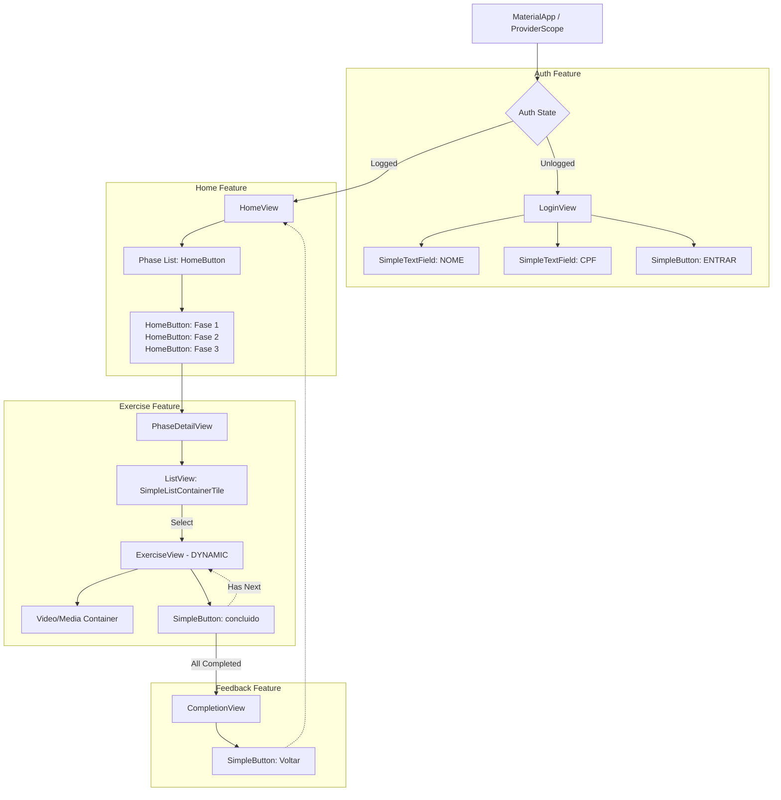

# REABILITA OMBRO: STRUCTURAL ARCHITECTURE

This document defines the structural foundation of the Reabilita Ombro Flutter application, integrating the user mockups (`CLIENT_MOCKUP.md`), UI constraints (`SPECS.md`), and the standard component library (`COMPONENTS_MAP.md`).

## 1. Architectural Review & Screen Unification

Based on the `CLIENT_MOCKUP.md` flow, several screens present redundant UI structures. To optimize the codebase and adhere to DRY (Don't Repeat Yourself) principles, the exercise video screens will be unified.

- **Unified `ExerciseView`**: Screens 4, 5, 6, and 7 are functionally identical apart from the content (video/image and title). They are unified into a single, dynamic `ExerciseView` component. 
- **Implementation Mechanism**: The `ExerciseView` will accept an `ExerciseModel` (containing URL, title, timer configuration, and logical pointers to the next step) and render the UI dynamically. When "concluido" is tapped, it pushes a new `ExerciseView` with the next model, or pushes the `CompletionView` if it's the last exercise.

## 2. Optimized Component Tree Hierarchy

The application will use a Feature-First architecture with the following Flutter Widget hierarchy, heavily leveraging the `componentes_padrao` library:

- **Main App (`MaterialApp`)**
  - Theme: Configured to use `AppColors` (`MY_BLUE`, `MY_WHITE`) and `AppTypography` (`Mulish`).
  - **`LoginView`** (Tela 1)
    - `SimpleTextField` (Label: NOME)
    - `SimpleTextField` (Label: CPF, `isCPF: true` for `brasil_fields` formatting)
    - `SimpleButton` ("ENTRAR", `dark: false`)
  - **`HomeView`** (Tela 2: Phase Selection)
    - Standard `AppBar`
    - Greeting Text (`H2` typography)
    - `HomeButton` (Fase 1)
    - `HomeButton` (Fase 2)
    - `HomeButton` (Fase 3)
  - **`PhaseDetailView`** (Tela 3)
    - Standard `AppBar` (Title: Dynamic Phase Name)
    - `ListView`
      - `SimpleListContainerTile` (Exercise 1)
      - `SimpleListContainerTile` (Exercise 2)
      - `SimpleListContainerTile` (Exercise 3)
  - **`ExerciseView`** (Telas 4-7 Unified)
    - Standard `AppBar`
    - Title Text (`H1` or `H2`)
    - Media Container (`VideoPlayer` or `Image`)
    - Action Area
      - `SimpleButton` ("concluido")
  - **`CompletionView`** (Tela 8)
    - Standard `AppBar`
    - Congratulatory Text
    - `SimpleButton` ("Voltar ao Início")

## 3. Interface Hierarchy Diagram

## 4. UI/UX Layout Constraints

- **Spacing & Padding (8-point grid):** All `SizedBox`, `Padding`, and margins must utilize multiples of 8 (e.g., 8, 16, 24, 32). Extrapolated from the library defaults (which often use 25.0, we will standardize to 24.0 or 32.0 in the actual implementation to respect the grid).
- **Responsive Layout:** The application will primarily target mobile, using `Expanded`, `Flexible`, and `Column`/`Row` widgets to adapt safely to various screen dimensions.
- **Dependency Re-use:** Layouts must *not* rebuild standard elements. The top-level `Scaffold` background will be `MY_WHITE` as defined in `AppColors`. All interactive navigation will prioritize `SimpleButton` or `HomeButton`.
