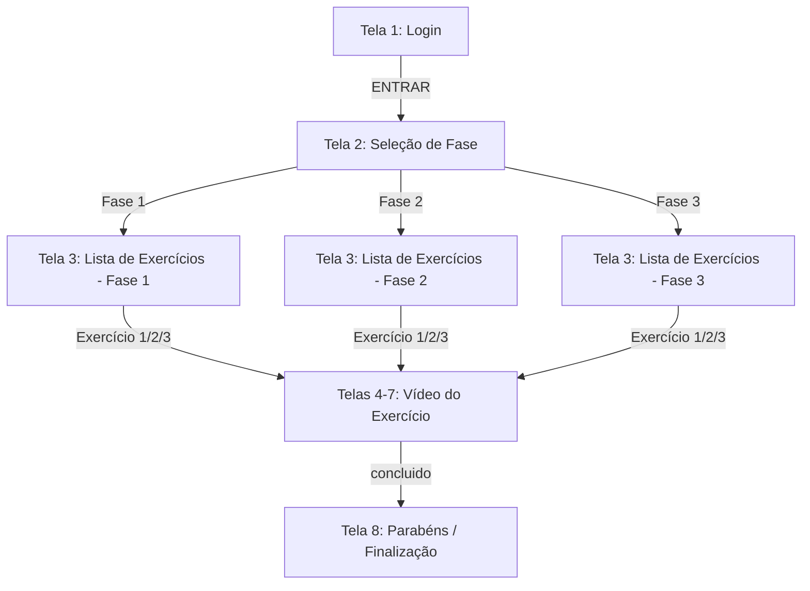

# CLIENT MOCKUP: REABILITA OMBRO

This document provides a factual transcription of the provided client mockup slides. It maps the screen flow, exact text content, and button actions for the Reabilita Ombro application.

---

## 1. Screen Flow Overview

---

## 2. Detailed Screen Breakdown

### Tela 1: Login
- **Header:** (None)
- **Central Text:** "Reabilita Ombro"
- **Form Fields:**
  - Label: "NOME" (Placeholder/Box)
  - Label: "CPF" (Placeholder/Box)
- **Primary Action:** "ENTRAR" (Button)

### Tela 2: Escolha a Fase
- **Header:** Menu Icon (Hamburger), "Teste"
- **Greeting:** "Olá [Nome]"
- **Prompt:** "Escolha a Fase"
- **Actions:**
  - Button: "Fase 1"
  - Button: "Fase 2"
  - Button: "Fase 3"

### Tela 3: Seleção de Exercício (Fase 1/2/3)
- **Header:** Menu Icon, "Fase 1" (Note: Header updates based on selected phase)
- **Prompt:** "Escolha o exercicio"
- **Actions:**
  - Button: "Exercicio 1"
  - Button: "Exercicio 2"
  - Button: "Exercicio 3"

### Telas 4, 5, 6, 7: Vídeo / Execução do Exercício
- **Header:** Menu Icon, "Teste"
- **Labels:** 
  - "Exercício 1" (Tela 4 / Tela 6 / Tela 7)
  - "Exercício 2" (Tela 5 / Tela 6 / Tela 7)
  - "Exercício 3" (Tela 5 / Tela 6 / Tela 7)
- **Content:** Central placeholder for video/image demonstrating the exercise.
- **Action:** Button "concluido"
- **Navigation Logic (Mockup specifics):**
  - Fase 1 / Ex 1 -> Vai para Tela 5 (Ex 2)
  - Fase 1 / Ex 2 -> Vai para Tela 8
  - Fase 1 / Ex 3 -> Vai para Tela 8
  - Fase 2 / Ex 1, 2, 3 -> Vai para Tela 8
  - Fase 3 / Ex 1, 2, 3 -> Vai para Tela 8

### Tela 8: Parabéns
- **Header:** Menu Icon, "Teste"
- **Main Message:** 
  > "Parabens ! Exercícios Hoje concluido !"

---

## 3. Visual Specifications (Factual)

- **Colors:**
  - Header: Deep Blue (#2E3B76 approx)
  - Background: Light Grey/Blue Tint
  - Buttons: Deep Blue with white text ("concluido", "ENTRAR")
  - List Buttons: White/Light Background with dark text
- **Typography:**
  - Headings/Titles: Sans-serif
  - Content: Standard readability font
- **Layout:**
  - Centered elements for Login.
  - Vertical list for Phase and Exercise selection.
  - Header structure consistent across app screens.
