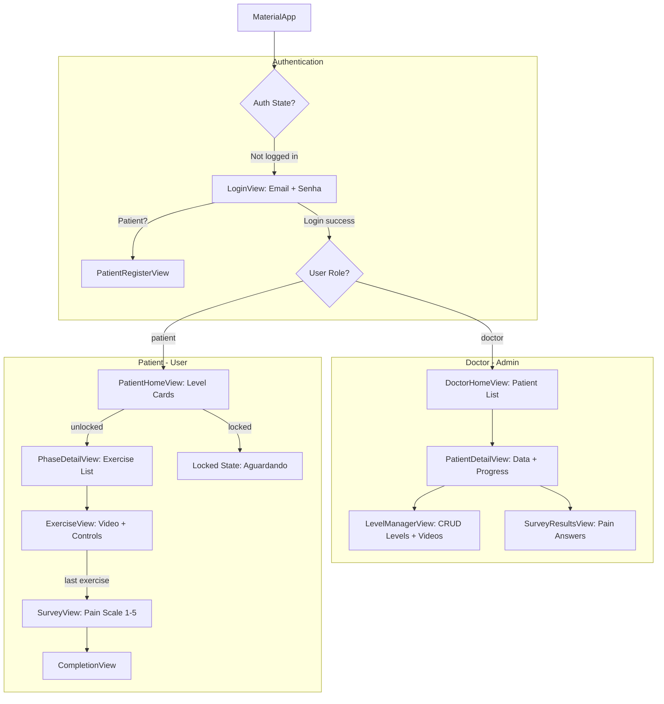

# REABILITA_OMBRO_PRODUCTION — PLAN v2

## SYSTEM_STATE
- **Phase**: Major Feature Update — Role-Based Auth, Doctor/Patient Views, Gamified Flow
- **Active_Agent**: @plan (The Architect)
- **Target_Agent**: @code (Claude Sonnet 4.6 Thinking)

---

## CONTEXT

This plan decomposes a major application overhaul into **9 sequential UPDATEs** (UPDATE6 → UPDATE12, including UPDATE10.5 and UPDATE10.6). Each UPDATE is an isolated, self-contained unit of work for `@code`. They **must be executed in order** — each depends on the artifacts of the previous one.

### Reference Material for @code
- **Auth logic to adapt**: `squad/assets/componentes_padrao/auth/authentication/` (Login.dart, Register_user.dart, register_patient.dart, services/)
- **Database service pattern**: `squad/assets/componentes_padrao/auth/authentication/services/database/database.dart`
- **Auth service pattern**: `squad/assets/componentes_padrao/auth/authentication/services/auth/` (auth.dart, signIn_firebase.dart, register_firebase.dart, signOut_firebase.dart)
- **UI Components**: `componentes_padrao` library (SimpleButton, SimpleTextField, ObscureTextField, SimpleListContainerTile, HomeButton, DatePickerTextField, AppColors, AppTypography)
- **Current codebase**: `lib/main.dart`, `lib/src/views/`, `lib/src/models/exercise_model.dart`

---

## NEW SCREEN FLOW



---

## FIRESTORE DATA MODEL

> This schema must be implemented across the UPDATEs. Defined here as the single source of truth.
> 
> **REVISION (UPDATE 10.6)**: The global `levels` collection was removed. Levels are now stored as **per-patient subcollections** under `users/{patientUid}/levels/`. This allows each patient to have a unique set of exercises assigned by the doctor.

### Collection: `users`
```
users/{uid}
├── uid: string
├── email: string
├── name: string
├── role: "doctor" | "patient"
├── createdAt: Timestamp
│
├── (if role == "patient")
│   ├── dateOfBirth: string (dd/mm/aaaa)
│   ├── age: int
│   ├── dateOfSurgery: string (dd/mm/aaaa)
│   ├── doctorUid: string (FK to doctor's uid)
│   └── (NO embedded levels map — see subcollection below)
```

### Subcollection: `users/{patientUid}/levels`
```
users/{patientUid}/levels/{levelId}  (auto-generated doc ID)
├── order: int (1-based sequential display order)
├── title: string ("Nível 1", "Nível 2", ...)
├── exercises: List<Map>
│   └── [{ title: string, videoUrl: string (YouTube URL) }]
├── status: "available" | "completed" | "waiting" | "locked"
├── completedAt: Timestamp? (null unless status == "completed")
├── createdAt: Timestamp
├── createdBy: string (doctor uid)
```

> **Key change**: `status` and `completedAt` are now fields on the level document itself (merged from the old `LevelProgress` class). No more `UserModel.levels` map or cross-referencing two collections.

### Collection: `surveys`
```
surveys/{surveyId}
├── patientUid: string
├── levelOrder: int
├── painBefore: int (1-5)
├── painDuring: int (1-5)
├── painAfter: int (1-5)
├── submittedAt: Timestamp
```

---

## EXECUTION_QUEUE

### [UPDATE 6] — Data Models & Auth Services (Foundation Layer)
**Goal**: Create all Dart data models and Firebase service classes. No UI yet.

**6.1 — New Dependencies (`pubspec.yaml`)**
- Add `cloud_firestore: ^5.0.0` to dependencies.
- Add `file_picker: ^8.0.0` to dependencies (will be needed in UPDATE 9 for video upload).
- Run `flutter pub get` after.

**6.2 — User Model (`lib/src/models/user_model.dart`) — CREATE**
- Adapt from `componentes_padrao/auth/authentication/services/database/database.dart` patterns.
- Define class `UserModel`:
  ```dart
  class UserModel {
    final String uid;
    final String email;
    final String name;
    final String role; // "doctor" or "patient"
    final DateTime createdAt;
    // Patient-only fields (nullable)
    final String? dateOfBirth;
    final int? age;
    final String? dateOfSurgery;
    final String? doctorUid;
    final Map<String, LevelProgress>? levels;
  }
  ```
- Define class `LevelProgress`:
  ```dart
  class LevelProgress {
    final String status; // "available", "completed", "waiting", "locked"
    final DateTime? completedAt;
  }
  ```
- Include `factory UserModel.fromFirestore(DocumentSnapshot doc)` and `Map<String, dynamic> toFirestore()` methods.

**6.3 — Level Model (`lib/src/models/level_model.dart`) — CREATE**
- Define class `LevelModel`:
  ```dart
  class LevelModel {
    final String id; // Firestore doc ID
    final int order;
    final String title;
    final List<ExerciseItem> exercises;
    final DateTime createdAt;
    final String createdBy;
  }
  ```
- Define class `ExerciseItem`:
  ```dart
  class ExerciseItem {
    final String title;
    final String videoUrl;
  }
  ```
- Include `fromFirestore` / `toFirestore` serialization.

**6.4 — Survey Model (`lib/src/models/survey_model.dart`) — CREATE**
- Define class `SurveyModel`:
  ```dart
  class SurveyModel {
    final String id;
    final String patientUid;
    final int levelOrder;
    final int painBefore; // 1-5
    final int painDuring; // 1-5
    final int painAfter;  // 1-5
    final DateTime submittedAt;
  }
  ```
- Include `fromFirestore` / `toFirestore` serialization.

**6.5 — Auth Service (`lib/src/services/auth_service.dart`) — CREATE**
- Adapt from `componentes_padrao/auth/authentication/services/auth/`.
- The structure is: a base `AuthService` class wrapping `FirebaseAuth`, then subclasses or methods for signIn, register, signOut.
- **Simplify into a single service class** (unlike the reference which splits into 4 files). Include:
  - `Future<UserCredential?> signIn({required String email, required String password})`
  - `Future<UserCredential?> registerPatient({required String email, required String password, required String name, required String dateOfBirth, required int age, required String dateOfSurgery})`
  - `Future<void> signOut()`
  - `Stream<User?> get authStateChanges`
- **Doctor does NOT register via app** — doctor credentials are hardcoded in Firebase Auth console. This service must NOT expose a `registerDoctor()` method.

**6.6 — Database Service (`lib/src/services/database_service.dart`) — CREATE**
- Adapt from `componentes_padrao/auth/authentication/services/database/database.dart` patterns (same Firestore collection/doc pattern).
- Methods needed (stubs with Firestore calls):
  - `Future<void> createUser(UserModel user)` — writes to `users/{uid}`
  - `Stream<UserModel> getUserStream(String uid)` — realtime user doc
  - `Stream<List<UserModel>> getPatientsStream()` — all docs where `role == "patient"`
  - `Future<void> updateLevelStatus(String patientUid, String levelKey, String newStatus)` — updates `users/{uid}.levels.{key}.status`
  - `Future<void> createLevel(LevelModel level)` — writes to `levels/` collection
  - `Future<void> deleteLevel(String levelId)` — deletes from `levels/`
  - `Stream<List<LevelModel>> getLevelsStream()` — all levels, ordered by `order`
  - `Future<void> reorderLevels(List<LevelModel> levels)` — batch write to fix sequential ordering
  - `Future<void> submitSurvey(SurveyModel survey)` — writes to `surveys/`
  - `Stream<List<SurveyModel>> getSurveysForPatient(String patientUid)` — queries surveys by patientUid

**STOP. Compile and verify: `flutter analyze`. Fix any import or type errors before proceeding.**

---

### [UPDATE 7] — Auth Gate & Login/Register UI
**Goal**: Replace the current anonymous auth with email/password login. Implement role-based routing.

**7.1 — Auth Gate Widget (`lib/src/views/auth_gate.dart`) — CREATE**
- A `StreamBuilder<User?>` that listens to `FirebaseAuth.instance.authStateChanges()`.
- If user is `null` → show `LoginView`.
- If user is authenticated → fetch user doc from Firestore (`users/{uid}`), check `role` field:
  - `"doctor"` → navigate to `DoctorHomeView`
  - `"patient"` → navigate to `PatientHomeView`
- Use a `FutureBuilder` for the Firestore lookup, show a loading spinner while resolving.

**7.2 — Rewrite `LoginView` (`lib/src/views/login_view.dart`) — OVERWRITE**
- Adapt from `componentes_padrao/auth/authentication/Login.dart` structure, but restyle using our `AppColors`/`AppTypography` (Mulish, MY_BLUE, MY_WHITE).
- Fields: **Email** (`SimpleTextField`) and **Senha** (`ObscureTextField`).
- "Entrar" button → calls `AuthService.signIn()`. On success, `AuthGate` handles routing.
- Below the login button: a divider with text "Não tem conta?" and a "Cadastrar-se" button that navigates to `PatientRegisterView`.
- **No "Cadastrar Médico" button** — doctor accounts are pre-created in Firebase console.
- Show error text in red below the form if login fails (same pattern as reference Login.dart line 216-219).

**7.3 — Patient Registration View (`lib/src/views/patient_register_view.dart`) — CREATE**
- Adapt from `componentes_padrao/auth/authentication/register_patient.dart` structure + `Register_user.dart`.
- Restyle to match our design system (MY_BLUE, MY_WHITE, Mulish font, 8-point grid).
- Fields (all required):
  1. `SimpleTextField` — Nome (string)
  2. `SimpleTextField` — Idade (number keyboard, `keyboardType: TextInputType.number`)
  3. `DatePickerTextField` — Data de Nascimento (dd/mm/aaaa)
  4. `DatePickerTextField` — Data da Cirurgia (dd/mm/aaaa)
  5. `SimpleTextField` — Email (`isEmail: true`)
  6. `ObscureTextField` — Senha (min 8 chars, `isPassword: true`)
- "Cadastrar" button → calls `AuthService.registerPatient()`, then `DatabaseService.createUser()` with `role: "patient"`, then navigates back to LoginView.
- "Já tem conta? Entrar" secondary button → pops back to LoginView.

**7.4 — Update `main.dart` — MODIFY**
- Change `initialRoute` from `'/home'` to use `AuthGate` as the `home:` widget of `MaterialApp`.
- Remove commented-out login route references.
- Update `routes:` and `onGenerateRoute:` to include all new view paths.
- Add `cloud_firestore` initialization is implicit with `firebase_core` — no extra init needed.

**STOP. Compile and test: Login with a test email/password (create one in Firebase console). Verify role routing works. Fix before proceeding.**

---

### [UPDATE 8] — Patient Home View (Gamified Level Cards)
**Goal**: Replace the old `HomeView` with a level-aware, lock-state home for patients.

**8.1 — Rename/Replace `HomeView` → `PatientHomeView` (`lib/src/views/patient_home_view.dart`) — CREATE**
- Fetches the patient's `UserModel` from Firestore (use `DatabaseService.getUserStream(uid)`).
- Fetches all `LevelModel` docs from Firestore (use `DatabaseService.getLevelsStream()`).
- For each level, cross-reference the patient's `levels` map to determine display status:
  - `"available"` → Normal card, tappable. Use `HomeButton` with full opacity.
  - `"completed"` → Checkmark overlay or green tint. Still tappable (replay).
  - `"waiting"` → Show text overlay: "Aguardando liberação do médico". Greyed out, NOT tappable.
  - `"locked"` → Show lock icon overlay. Greyed out, NOT tappable.
- Level 1 defaults to `"available"` for new patients. All others default to `"locked"`.
- Each tappable card navigates to `/phase_detail` passing the `LevelModel`.
- Include a logout icon button in the AppBar.

**8.2 — Update `PhaseDetailView` (`lib/src/views/phase_detail_view.dart`) — MODIFY**
- Change the constructor to accept a `LevelModel` instead of a raw `int phase`.
- Render exercise list from `LevelModel.exercises` (List<ExerciseItem>) instead of `ExerciseModel.mockExercises`.
- Each tile navigates to `/exercise` passing the `ExerciseItem` and the index/total for progress tracking.

**8.3 — Update `ExerciseView` (`lib/src/views/exercise_view.dart`) — MODIFY**
- Change constructor to accept an `ExerciseItem` (title + videoUrl) plus `currentIndex`, `totalExercises`, and `levelOrder`.
- The video URL is still `gs://...` — keep the existing `FirebaseStorage.getDownloadURL()` resolution logic.
- When the last exercise's "concluido" button is tapped:
  - Instead of navigating to `CompletionView`, navigate to `SurveyView` (passing `levelOrder`).
- When a non-last exercise's "concluido" is tapped:
  - Navigate to next `ExerciseView` in the sequence.

**8.4 — Delete old `home_view.dart`** — the old file is replaced by `patient_home_view.dart`.

**STOP. Compile and test: Verify patient can see levels with locked/available states. Navigate through exercises. Fix before proceeding.**

---

### [UPDATE 9] — Doctor Home View & Level Management
**Goal**: Build the doctor's admin panel for managing patients and levels.

**9.1 — Doctor Home View (`lib/src/views/doctor/doctor_home_view.dart`) — CREATE**
- Create subdirectory `lib/src/views/doctor/`.
- AppBar: "Reabilita Ombro — Painel Médico", with logout icon.
- Body: Two tabs or sections:
  1. **Pacientes** — `StreamBuilder` using `DatabaseService.getPatientsStream()`. Renders a `ListView` of `SimpleListContainerTile` for each patient, showing: name, age, date of surgery. Tapping navigates to `PatientDetailView`.
  2. **Níveis** — `StreamBuilder` using `DatabaseService.getLevelsStream()`. Shows the master list of levels. A FAB (FloatingActionButton) labeled "+" to create a new level → opens `LevelManagerView`.

**9.2 — Level Manager View (`lib/src/views/doctor/level_manager_view.dart`) — CREATE**
- **Mode**: Can be "create" (new level) or "edit" (existing level).
- Title field: auto-populated as "Nível [N+1]" (next sequential number).
- **Exercise list builder**: A dynamic list where the doctor can:
  - Add an exercise row: `SimpleTextField` for title + a "Upload" button.
  - The "Upload" button triggers `FilePicker.platform.pickFiles()` with:
    - `type: FileType.custom`, `allowedExtensions: ['mp4']`
    - After picking, check `file.size <= 5 * 1024 * 1024` (5MB). If too large, show `SnackBar` error: "O vídeo deve ter no máximo 5MB."
    - Upload to Firebase Storage at path `videos/{levelId}/{filename}`.
    - Store the resulting `gs://` URI in the exercise item.
  - Remove an exercise row (icon button).
- "Salvar Nível" button → calls `DatabaseService.createLevel()` / update.
- All levels form a **single flat list** (not grouped by folders). The doctor assigns exercises to each level manually.

**9.3 — Level Deletion & Reordering Logic**
- Each level card in the doctor's Níveis tab has a delete icon.
- On delete: call `DatabaseService.deleteLevel(levelId)`, then fetch remaining levels, re-assign `order` values sequentially (1, 2, 3, ...), and batch-write using `DatabaseService.reorderLevels()`.
- **Example**: If levels [1, 2, 3, 4, 5] and doctor deletes level 4 → result is [1, 2, 3, 4] (old level 5 becomes order 4).

**STOP. Compile and test: Create a level with uploaded video. Delete a level and verify renumbering. Fix before proceeding.**

---

### [UPDATE 10] — Doctor Patient Detail & Level Release
**Goal**: Doctor can view a patient's progress and release levels.

**10.1 — Patient Detail View (`lib/src/views/doctor/patient_detail_view.dart`) — CREATE**
- Header section showing patient data: **Name**, **Age**, **Date of Birth**, **Date of Surgery**.
- **Progress Section**: `StreamBuilder` on the patient's `UserModel`.
  - For each level that exists in the master `levels` collection, show:
    - Level title
    - Status badge: `"available"` (blue), `"completed"` (green), `"waiting"` (yellow), `"locked"` (grey)
    - If status is `"completed"` → show completedAt date
    - If status is `"waiting"` → show a **"Liberar" button** (prominent, blue). On tap: calls `DatabaseService.updateLevelStatus(patientUid, nextLevelKey, "available")` to unlock the next sequential level for that patient.
    - If status is `"completed"` and next level is `"locked"` (not yet "waiting") → this means the patient hasn't completed the current level yet or hasn't triggered the waiting state — no action needed.
  - Below each level's status: a "Ver Pesquisa" link that navigates to `SurveyResultsView` for that patient+level combo.

**10.2 — Survey Results View (`lib/src/views/doctor/survey_results_view.dart`) — CREATE**
- Receives `patientUid` and `levelOrder` as arguments.
- `StreamBuilder` on `DatabaseService.getSurveysForPatient(patientUid)` filtered by `levelOrder`.
- Displays in a clean card:
  - "Dor antes dos exercícios: X/5"
  - "Dor durante os exercícios: X/5"
  - "Dor depois dos exercícios: X/5"
- If no survey submitted yet, show: "Pesquisa ainda não respondida."

**STOP. Compile and test: View a patient's progress. Release a level. Check survey data renders. Fix before proceeding.**

---

### [UPDATE 10.5] — YouTube Video Migration
**Goal**: Replace Firebase Storage video uploads with YouTube URLs. Videos are uploaded to YouTube (unlisted or public) manually. The doctor pastes a YouTube URL when creating exercises. The patient watches via an embedded YouTube player.

> **DECISION LOG**: Google Drive was rejected because (1) listing files requires the Drive API + credentials, (2) direct download URLs trigger virus-scan interstitials for files >100MB breaking `video_player`, (3) rate limiting on public folders, (4) no adaptive streaming. YouTube provides free CDN-backed streaming with a simple URL-based workflow.

**10.5.1 — Dependency Changes (`pubspec.yaml`) — MODIFY**
- **Add**: `youtube_player_flutter: ^9.1.1` (or latest stable).
- **Remove**: `firebase_storage` — it is no longer used anywhere.
- **Remove**: `file_picker` — no more client-side file uploads.
- **Remove**: `video_player` — replaced by the YouTube player.
- Run `flutter pub get` after.
- Run `flutter analyze` to surface any remaining references to removed packages.

**10.5.2 — Update `ExerciseView` (`lib/src/views/exercise_view.dart`) — REWRITE**
- Remove all `video_player` and `firebase_storage` imports.
- Import `youtube_player_flutter`.
- Replace the `VideoPlayerController` logic with:
  ```dart
  late YoutubePlayerController _ytController;

  @override
  void initState() {
    super.initState();
    final videoId = YoutubePlayer.convertUrlToId(_exercise.videoUrl) ?? '';
    _ytController = YoutubePlayerController(
      initialVideoId: videoId,
      flags: const YoutubePlayerFlags(
        autoPlay: true,
        mute: false,
        forceHD: false,
      ),
    );
  }
  ```
- Replace the video widget area with:
  ```dart
  YoutubePlayer(
    controller: _ytController,
    showVideoProgressIndicator: true,
    progressIndicatorColor: MY_BLUE,
  )
  ```
- Remove the `_togglePlayPause()` method and the manual play/pause icon overlay — `YoutubePlayer` has built-in controls.
- Keep all navigation logic (prev/next exercise, survey on last) unchanged.
- Dispose `_ytController` in `dispose()`.

**10.5.3 — Update `LevelManagerView` (`lib/src/views/doctor/level_manager_view.dart`) — REWRITE**
- Remove all `file_picker`, `firebase_storage`, and `dart:io` imports.
- Remove the `_pickAndUpload()` method entirely.
- Remove the `isUploading` and `videoFilename` fields from `_ExerciseEntry`.
- In each `_ExerciseRow`, replace the upload button + progress indicator with:
  - A `SimpleTextField` for the YouTube URL:
    ```
    label: 'URL DO YOUTUBE'
    hintText: 'https://www.youtube.com/watch?v=...'
    controller: entry.videoUrlController
    errorMessage: 'URL obrigatória'
    ```
  - Below the text field, add a **preview thumbnail** that updates live:
    ```dart
    // Extract video ID and show thumbnail
    final videoId = YoutubePlayer.convertUrlToId(entry.videoUrlController.text);
    if (videoId != null)
      Image.network('https://img.youtube.com/vi/$videoId/0.jpg', height: 80)
    ```
- In `_save()`: validate that each URL is a valid YouTube URL using `YoutubePlayer.convertUrlToId()` (returns null if invalid). Show a SnackBar error if invalid.
- The `ExerciseItem.videoUrl` field now stores the full YouTube URL (e.g., `https://www.youtube.com/watch?v=XXXX` or `https://youtu.be/XXXX`).

**10.5.4 — Clean Up Firebase Storage References**
- Search the entire `lib/` directory for any remaining `firebase_storage` imports and remove them.
- Search for `FirebaseStorage`, `getDownloadURL`, `gs://` — none should remain.
- Confirm that `pubspec.yaml` no longer lists `firebase_storage`, `file_picker`, or `video_player`.

**STOP. Compile and test: Doctor creates a level → pastes a YouTube URL → save. Patient opens exercise → YouTube video plays inline. Fix before proceeding.**

---

### [UPDATE 10.6] — Per-Patient Level Assignment Architecture
**Goal**: Replace the global `levels` collection with per-patient subcollections so each patient has unique levels assigned by the doctor.

> **DECISION LOG**: Previously, levels were a global flat collection shared by all patients. The doctor could only create one set of levels and every patient saw the same exercises. This doesn't match the clinical workflow where each patient receives individualized rehabilitation protocols. The fix is to store levels as `users/{patientUid}/levels/{levelId}` subcollections.

**10.6.1 — Update `LevelModel` (`lib/src/models/level_model.dart`) — MODIFY**
- **Add fields** to `LevelModel`:
  - `String status` — one of `"available"`, `"completed"`, `"waiting"`, `"locked"` (default: `"locked"`).
  - `DateTime? completedAt` — null unless status is `"completed"`.
- Update `fromFirestore` and `toFirestore` to include these new fields.
- Update `copyWith` to support the new fields.
- **Delete the `LevelProgress` class** — it is fully replaced by these merged fields.

**10.6.2 — Update `UserModel` (`lib/src/models/user_model.dart`) — MODIFY**
- **Remove** the `Map<String, LevelProgress>? levels` field entirely.
- Remove the `LevelProgress` class if it still exists.
- Remove any references to `levels` in `fromFirestore`, `toFirestore`, and constructor.
- Patient registration no longer initializes `levels: { "1": { status: "available" } }` — this is handled by the doctor assigning the first level.

**10.6.3 — Update `DatabaseService` (`lib/src/services/database_service.dart`) — MAJOR MODIFY**
- **Remove** the `_levels` top-level collection reference.
- **Remove** old global level methods: `createLevel`, `updateLevel`, `deleteLevel`, `_reorderLevels`, `reorderLevels`, `getLevelsStream`, `getLevels`, `getNewLevelId`.
- **Remove** `updateLevelStatus` (was operating on `UserModel.levels` map — that map no longer exists).
- **Add** new per-patient level methods using subcollection `_db.collection('users').doc(patientUid).collection('levels')`:
  ```dart
  // Returns the levels subcollection ref for a specific patient
  CollectionReference<Map<String, dynamic>> _patientLevels(String patientUid) =>
      _users.doc(patientUid).collection('levels');

  // Create a level for a specific patient
  Future<String> createPatientLevel(String patientUid, LevelModel level) async { ... }

  // Update a level (exercises, status, etc.) for a specific patient
  Future<void> updatePatientLevel(String patientUid, LevelModel level) async { ... }

  // Delete a level for a specific patient and reorder remaining
  Future<void> deletePatientLevel(String patientUid, String levelId) async { ... }

  // Reorder levels for a specific patient after deletion
  Future<void> _reorderPatientLevels(String patientUid) async { ... }

  // Stream all levels for a specific patient, sorted by order
  Stream<List<LevelModel>> getPatientLevelsStream(String patientUid) { ... }

  // Update just the status of a patient's level by level order key
  Future<void> updatePatientLevelStatus(String patientUid, int levelOrder, String newStatus, {bool markCompleted = false}) async {
    // Query subcollection for doc with matching order, then update
  }
  ```

**10.6.4 — Update `DoctorHomeView` (`lib/src/views/doctor/doctor_home_view.dart`) — MODIFY**
- **Remove** the "Níveis" tab entirely — levels are no longer global.
- **Remove** `DefaultTabController`, `TabBar`, `TabBarView`.
- Convert to a single-view page showing only the patient list (what was the "Pacientes" tab).
- **Remove** the `_NiveisTab`, `_LevelAdminCard`, and `_NiveisFab` widgets.
- Keep the patient list `StreamBuilder` using `getPatientsStream()`.

**10.6.5 — Update `PatientDetailView` (`lib/src/views/doctor/patient_detail_view.dart`) — MODIFY**
- **Replace the dual-StreamBuilder** (UserModel + global levels) with a single `StreamBuilder<List<LevelModel>>` on `getPatientLevelsStream(patient.uid)`.
- Level cards now get their `status` and `completedAt` directly from the `LevelModel` (no more cross-referencing `UserModel.levels`).
- **Add a FAB** (FloatingActionButton) to create a new level for this patient:
  - `onPressed` → navigate to `/level_manager` passing `LevelManagerArgs(patientUid: patient.uid, nextOrder: levels.length + 1)`.
- **Add edit/delete icon buttons** to each level card:
  - Edit → navigate to `/level_manager` passing `LevelManagerArgs(patientUid: patient.uid, existingLevel: level, nextOrder: level.order)`.
  - Delete → confirmation dialog → `deletePatientLevel(patient.uid, level.id)`.
- The "Liberar" button now calls `updatePatientLevelStatus(patient.uid, level.order, "available")` instead of `updateLevelStatus(patientUid, levelKey, "available")`.

**10.6.6 — Update `LevelManagerArgs` and `LevelManagerView` (`lib/src/views/doctor/level_manager_view.dart`) — MODIFY**
- Add `String patientUid` to `LevelManagerArgs` (required).
- In `_save()`: call `createPatientLevel(args.patientUid, level)` for create mode, `updatePatientLevel(args.patientUid, level)` for edit mode.
- When creating the **first level** for a patient (nextOrder == 1), set `status: "available"`. For subsequent levels, set `status: "locked"`.

**10.6.7 — Update `PatientHomeView` (`lib/src/views/patient_home_view.dart`) — MODIFY**
- **Replace the dual-StreamBuilder** (UserModel + global levels) with:
  - A single `StreamBuilder<List<LevelModel>>` on `getPatientLevelsStream(uid)` — the subcollection already contains both content and status.
- Level cards now read `level.status` directly from the `LevelModel`.
- Remove the cross-referencing logic that looked up `patient.levels?[key]?.status`.
- If the subcollection is empty, show the existing "no levels" empty state.

**10.6.8 — Clean up old references**
- Search for `getLevelsStream()` (without patientUid arg) — should no longer exist.
- Search for `UserModel.levels` — should no longer be referenced.
- Search for `LevelProgress` — class should be deleted.
- Search for `updateLevelStatus` — should be replaced by `updatePatientLevelStatus`.
- Run `flutter analyze` and fix any issues.

**STOP. Compile and test: Doctor opens patient → creates a level → patient sees only THEIR levels. Create a second patient → they have no levels. Assign different levels to each. Fix before proceeding.**

---

### [UPDATE 11] — Survey View & Level Completion Flow
**Goal**: End-of-level pain survey + automatic status transitions.

**11.1 — Survey View (`lib/src/views/survey_view.dart`) — CREATE**
- Shown after the patient completes the **last exercise** of a level.
- Title: "Como você se sentiu?"
- Three questions, each with a **1-5 scale selector** (use a `Row` of 5 tappable circles or `ToggleButtons`):
  1. "Nível de dor ANTES dos exercícios" → `painBefore`
  2. "Nível de dor DURANTE os exercícios" → `painDuring`
  3. "Nível de dor DEPOIS dos exercícios" → `painAfter`
- Scale labels: 1 = "Nenhuma", 5 = "Muito forte"
- "Enviar" button (disabled until all 3 are answered):
  - Calls `DatabaseService.submitSurvey(SurveyModel(...))`.
  - Calls `DatabaseService.updatePatientLevelStatus(patientUid, currentLevelOrder, "completed", markCompleted: true)` — note: uses the **new per-patient method**.
  - **If a next level exists** in the patient's subcollection: calls `DatabaseService.updatePatientLevelStatus(patientUid, nextLevelOrder, "waiting")`.
  - Navigates to `CompletionView`.

**11.2 — Update `CompletionView` (`lib/src/views/completion_view.dart`) — MODIFY**
- Update the congratulatory text to reflect the level name: "Parabéns! Nível [N] concluído!"
- The "Voltar ao Início" button → navigates to `PatientHomeView` (clearing stack).
- If the next level is `"waiting"`, show additional text: "O próximo nível será liberado pelo seu médico."

**STOP. Compile and test: Complete a level as patient. Verify survey appears, submits to Firestore, and the next level transitions to "waiting". Fix before proceeding.**

---

### [UPDATE 12] — Route Wiring, Cleanup & Integration Test
**Goal**: Final routing cleanup, dead code removal, and full integration pass.

**12.1 — Final `main.dart` Route Wiring — MODIFY**
- Ensure `onGenerateRoute` covers all new paths:
  - AuthGate (declarative root) → `PatientHomeView` or `DoctorHomeView`
  - `/patient_register` → `PatientRegisterView`
  - `/phase_detail` → `PhaseDetailView` (expects `LevelModel`)
  - `/exercise` → `ExerciseView` (expects `ExerciseViewArgs`)
  - `/survey` → `SurveyView`
  - `/completion` → `CompletionView`
  - `/patient_detail` → `PatientDetailView`
  - `/level_manager` → `LevelManagerView`
  - `/survey_results` → `SurveyResultsView`

**12.2 — Delete Dead Code**
- Delete `lib/src/models/exercise_model.dart` (replaced by `LevelModel` + `ExerciseItem`).
- Delete `lib/src/views/home_view.dart` if still present (replaced by `PatientHomeView`).
- Remove any remaining references to `ExerciseModel.mockExercises` anywhere.
- Confirm `firebase_storage`, `file_picker`, and `video_player` are fully removed from `pubspec.yaml` and all imports.
- Confirm `LevelProgress` class no longer exists.
- Confirm no global `_levels` collection reference exists in `DatabaseService`.

**12.3 — Firestore Security Rules (Document for manual setup)**
- Output a `firestore.rules` snippet for the user to paste into Firebase Console:
  ```
  rules_version = '2';
  service cloud.firestore {
    match /databases/{database}/documents {
      match /users/{uid} {
        allow read: if request.auth != null;
        allow write: if request.auth.uid == uid || get(/databases/$(database)/documents/users/$(request.auth.uid)).data.role == "doctor";

        // Per-patient levels subcollection
        match /levels/{levelId} {
          allow read: if request.auth != null && (request.auth.uid == uid || get(/databases/$(database)/documents/users/$(request.auth.uid)).data.role == "doctor");
          allow write: if get(/databases/$(database)/documents/users/$(request.auth.uid)).data.role == "doctor";
        }
      }
      match /surveys/{surveyId} {
        allow read: if request.auth != null;
        allow write: if request.auth != null;
      }
    }
  }
  ```

**12.4 — Full Integration Test Checklist (Manual)**
- [✓] Patient registers with name, age, DOB, surgery date, email, password
- [✓] Patient logs in → sees "no levels" empty state (doctor hasn't assigned any yet)
- [✓] Doctor logs in → sees patient list → taps patient → sees empty level list
- [✓] Doctor creates Level 1 for patient → pastes YouTube URL → saves → level appears with status "available"
- [✓] Doctor creates Level 2 for patient → saves → appears with status "locked"
- [✓] Patient logs in → sees Level 1 available, Level 2 locked
- [✓] Patient opens Level 1 → exercises listed → YouTube video plays
- [X] Patient completes last exercise → survey appears → submits pain scores  // ERROR, patient doesn't have permission to submit survey in Firestore Security Rules → `Erro ao enviar pesquisa: [cloud_firestore/permission-denied] The caller does not have permission to execute the specified operation.`
- [-] Level 1 shows "completed", Level 2 shows "Aguardando liberação" // NO TEST. Survey submition error prevented this step from being tested.
- [-] Doctor taps "Liberar" on Level 2 → patient now sees Level 2 available // NO TEST. Survey submition error prevented this step from being tested.
- [✓] Doctor edits a level → existing YouTube URLs pre-populated → can change
- [✓] Doctor deletes a level → numbering auto-corrects
- [-] Doctor views survey results for completed levels → pain gauge renders // NO TEST. Survey submition error prevented this step from being tested.
- [✓] Create a SECOND patient → they have zero levels → doctor assigns different levels to them

**STOP. This is the final UPDATE. Run `flutter analyze` and `flutter build apk --debug` to validate.**

---

### [UPDATE 13] — Bug Fix: Survey Permission + UI Polish
**Goal**: Fix the Firestore permission-denied error blocking survey submission flow, improve ExerciseView layout, and fix placeholder text color across all text fields.

> **@debug AUDIT (2026-05-18)**: The error `[cloud_firestore/permission-denied]` on survey submission is caused by the `levels` subcollection write rule. When a patient completes a level, `SurveyView._submit()` writes to `surveys/{surveyId}` (succeeds — rules allow any auth'd user), then calls `updatePatientLevelStatus()` which writes to `users/{patientUid}/levels/{levelId}` to mark the level as `completed` and transition the next level to `waiting`. This write **fails** because `firestore.rules` line 20 restricts level writes to doctors only: `allow write: if get(...).data.role == "doctor"`. The patient must be allowed to update their own level status.

**13.1 — Fix Firestore Security Rules (`firestore.rules`) — MODIFY**

Open `firestore.rules` at the project root. Find the `levels` subcollection write rule (currently line 20):

```
allow write: if get(/databases/$(database)/documents/users/$(request.auth.uid)).data.role == "doctor";
```

Replace it with:

```
allow write: if request.auth.uid == uid
             || get(/databases/$(database)/documents/users/$(request.auth.uid)).data.role == "doctor";
```

This allows patients to write to **their own** levels subcollection (to mark levels completed) while still allowing doctors to write to **any** patient's levels.

> **MANUAL STEP REQUIRED**: After modifying the file, the user must also paste the updated rules into **Firebase Console → Firestore → Rules tab** and publish. The file is only a local reference — Firestore rules are deployed via the console.

**13.2 — ExerciseView Layout: Title Above Centered Video (`lib/src/views/exercise_view.dart`) — MODIFY**

Currently (lines 171–187) the layout is: `[YouTube Player] → [SizedBox(24)] → [Exercise Title] → [Spacer] → [Buttons]`.

Change the order and centering so the title appears **above** the video and the player is **horizontally centered**. The new layout inside the `Column` children (lines 171–187) should be:

```dart
// ── Exercise title (above video) ─────────────────────────
Text(
  _exercise.title,
  style: H1(textColor: MY_BLACK),
  textAlign: TextAlign.center,
),

const SizedBox(height: 24.0),

// ── YouTube Player (centered) ────────────────────────────
Center(
  child: ClipRRect(
    borderRadius: BorderRadius.circular(8.0),
    child: player,
  ),
),

const Spacer(),
```

Remove the old `Text(_exercise.title, ...)` block that was below the player (lines 181–185). The title must only appear once, above the video.

**13.3 — Gray Placeholder Text in `componentes_padrao` (`squad/assets/componentes_padrao/lib/components/text_fields/text_fields.dart`) — MODIFY**

The light-mode `hintStyle` in three widget types currently renders placeholder text in black (`MY_BLACK`) or with no color override (which defaults to the theme's text color, i.e. black). Fix all of them to use `MY_GREY` instead:

1. **`SimpleTextField`** (line 62): Change:
   ```dart
   hintStyle: BODY().copyWith(fontWeight: FontWeight.w600),
   ```
   to:
   ```dart
   hintStyle: BODY(textColor: MY_GREY).copyWith(fontWeight: FontWeight.w600),
   ```

2. **`ObscureTextField`** (line 180): Same change — add `textColor: MY_GREY` to the light-mode `BODY()` hint style.

3. **`DatePickerTextField`** (line 324): Change:
   ```dart
   hintStyle: BODY(textColor: MY_BLACK).copyWith(fontWeight: FontWeight.w600),
   ```
   to:
   ```dart
   hintStyle: BODY(textColor: MY_GREY).copyWith(fontWeight: FontWeight.w600),
   ```

4. **`TimePickerTextField`** (line 431): Same change as DatePickerTextField — replace `MY_BLACK` with `MY_GREY`.

> **NOTE**: Only the **light mode** (`dark: false`) hint styles need this fix. The dark mode versions correctly use `MY_WHITE`. All four text field widgets in the file must be updated.

**STOP. Compile and test:**
1. `flutter analyze lib\` — must report no issues.
2. `flutter build apk --debug` — must succeed.
3. Re-test integration checklist items 5.10–5.13 from UPDATE 12.4:
   - Patient completes last exercise → survey appears → submits pain scores → **no permission error**.
   - Level 1 shows "completed", Level 2 shows "Aguardando liberação".
   - Doctor taps "Liberar" on Level 2 → patient now sees Level 2 available.
   - Doctor views survey results for completed levels → pain gauge renders.
4. Verify all text field placeholders across LoginView, PatientRegisterView, and LevelManagerView render in **gray** (not black).
5. Verify ExerciseView shows title **above** the centered video player.

---

### [UPDATE 14] — Confirm Password Field on Registration
**Goal**: Add a "Confirme sua senha" field to `PatientRegisterView` that validates the passwords match before allowing registration.

**14.1 — Add controller and dispose (`lib/src/views/patient_register_view.dart`) — MODIFY**

1. In the `_PatientRegisterViewState` class, after `_passwordController` (line 36), add:
   ```dart
   final _confirmPasswordController = TextEditingController();
   ```

2. In `dispose()` (line 44–52), add `_confirmPasswordController.dispose();` before `super.dispose();`.

**14.2 — Add the confirm password widget — MODIFY**

After the existing `ObscureTextField` for "SENHA" (lines 208–215) and its trailing `SizedBox(height: 16.0)` on line 216, insert a new confirm password field **before** the `SizedBox(height: 32.0)` on the same line 216:

```dart
const SizedBox(height: 16.0),

// ── Confirmar Senha ──────────────────────────────────────
ObscureTextField(
  dark: false,
  label: 'CONFIRME SUA SENHA',
  hintText: 'Digite sua senha novamente',
  controller: _confirmPasswordController,
  errorMessage: 'Confirmação obrigatória',
  isPassword: false, // Disable length validation — that's handled by the primary field
),
```

Change the `SizedBox(height: 16.0)` that was on line 216 to `SizedBox(height: 32.0)` (the gap before the register button). The net result should be: `[Senha field] → [SizedBox(16)] → [Confirme sua senha field] → [SizedBox(32)] → [Register button]`.

**14.3 — Add match validation in `_handleRegister()` — MODIFY**

At the **top** of `_handleRegister()`, right after the `if (!_formKey.currentState!.validate()) return;` guard (line 56), add a password-match check:

```dart
if (_passwordController.text != _confirmPasswordController.text) {
  setState(() => _errorMessage = 'As senhas não coincidem.');
  return;
}
```

This ensures both passwords are identical before attempting Firebase Auth registration.

**STOP. Compile and test:**
1. `flutter analyze lib\` — must report no issues.
2. `flutter build apk --debug` — must succeed.
3. Manual test: Open registration screen → fill all fields → type mismatched passwords → tap "CADASTRAR" → verify error "As senhas não coincidem." appears. Fix passwords to match → registration succeeds.

---

## NEXT ACTIONABLE STEP
→ Execute UPDATE 14.